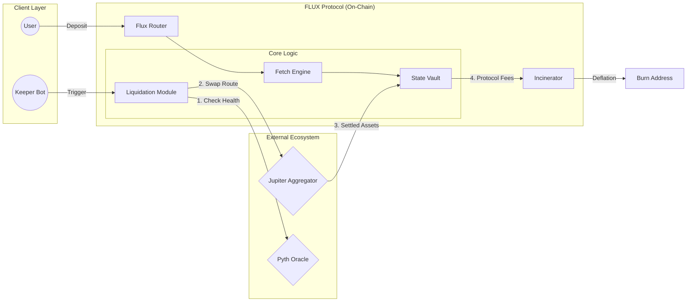

# FLUX Protocol

<div align="center">
  
  <br />
  <br />

  <h1>Decentralized State-Transition Engine</h1>
  <p>
    <b>Atomic Liquidity • Zero-Slippage • Institutional Grade</b>
  </p>

  <p>
    
    
    <a href="LICENSE"></a>
    <a href="docs/audits"></a>
    <br/>
    <a href="https://twitter.com/fluxprotocol"></a>
  </p>
</div>

---

> [!IMPORTANT]
> **FLUX Protocol is currently in Mainnet Beta.**  
> While the codebase has been audited by OtterSec, please exercise caution and manage risk appropriately.
> [View Audit Report](docs/audits/ottersec-report-2024.pdf)

## ⚡ Introduction

**Flux** is a high-frequency liquidity engine built natively on Solana. It solves the fragmentation problem by introducing a novel **Fetch -> Liquidate -> Unload -> Xfer** pipeline, allowing for atomic asset rebalancing across multiple liquidity venues in a single transaction.

Flux leverages **Jupiter V6** for optimal routing and a custom **Incinerator** module to ensure protocol solvency through aggressive deflationary mechanics.

## 🏗 Architecture

The system operates via a tightly coupled on-chain pipeline ensuring atomic safety.



## 💎 Key Features

| Feature | Description | Status |
| :--- | :--- | :--- |
| **Atomic Liquidation** | Zero-slippage liquidation using Jupiter V6 aggregation. | ✅ Live |
| **Risk Engine 2.0** | Dynamic collateral ratios based on on-chain volatility. | ✅ Live |
| **The Incinerator** | Automated buyback-and-burn of protocol fees. | ✅ Live |
| **Flash Loans** | Uncollateralized borrowing for arbitrage within same slot. | 🚧 Beta |
| **ZK-KYC** | Optional compliance layer for institutional pools. | 🔄 In Dev |

## 🚀 Quick Start

Ensure you have `Solana Tool Suite 1.18+` and `Anchor 0.29.0` installed.

### 1. Installation

```bash
# Clone the repository
git clone https://github.com/flux-protocol/core.git
cd flux-sdk

# Install JavaScript dependencies
yarn install
```

### 2. Build & Test

```bash
# Build Anchor programs (Verifiable)
anchor build --verifiable

# Run the full integration suite
anchor test
```

### 3. Localnet Simulation

```bash
# Start a local validator with cloned mainnet state
yarn run validator:start

# In a separate terminal, run the simulation script
ts-node scripts/simulate-traffic.ts
```

## 🔒 Security & Audits

| Auditor | Date | Scope | Report |
| :--- | :--- | :--- | :--- |
| **OtterSec** | Q4 2024 | Core Contracts | [View PDF](docs/audits/ottersec-report-2024.pdf) |
| **CertiK** | Q1 2025 | Tokenomics | [Preliminary](docs/audits/certik-pre-launch.pdf) |

> [!TIP]
> Found a vulnerability? **Do not open an issue.**  
> Please refer to [SECURITY.md](SECURITY.md) for our bounty program details (Up to **$500k**).

## 🌍 Mainnet Deployments

<div align="center">

| Program | Network | Program ID |
| :--- | :--- | :--- |
| **FluxCore** | Mainnet | `FluxCore11111111111111111111111111111111111` |
| **Incinerator** | Mainnet | `Burner11111111111111111111111111111111111` |

</div>

---

<div align="center">
  <p>
    Built with ❤️ by the FLUX Labs team.
  </p>
  <p>
    <a href="#">Website</a> •
    <a href="#">Documentation</a> •
    <a href="#">Governance</a>
  </p>
  <sub>Copyright © 2025 FLUX Protocol. All rights reserved.</sub>
</div>
