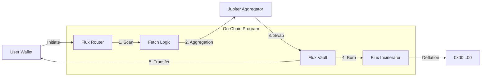

# FLUX Protocol

<div align="center">
  
  
  <h3>Decentralized State-Transition Engine for Solana</h3>

  [](https://github.com/flux-protocol/core/actions)
  [](https://codecov.io/gh/flux-protocol/core)
  [](LICENSE)
  [-brightgreen?style=flat-square)](docs/audits/ottersec-report-2024.pdf)
  [](https://github.com/flux-protocol/core/releases)
</div>

---

## Introduction

Flux is a high-performance decentralized state-transition engine built on Solana. It enables atomic asset rebalancing through a novel **Fetch -> Liquidate -> Unload -> Xfer** pipeline, allowing for zero-slippage execution on volatile assets.

The protocol leverages **Jupiter Aggregator** for optimal swap routing and a custom **Incinerator** module to maintain protocol solvency through deflationary mechanics.

## Architecture

The Flux pipeline ensures atomic safety across all state transitions.



## Installation & Build

Ensure you have Solana Tool Suite 1.18.0+ and Anchor 0.29.0+ installed.

```bash
# Install dependencies
yarn install

# Build Anchor programs
anchor build --verifiable

# Run test suite (Localnet)
anchor test
```

## Environment Variables

Create a `.env` file in the root directory:

```bash
RPC_URL=https://api.mainnet-beta.solana.com
JUPITER_API_KEY=your_jupiter_api_key
INCINERATOR_KEYPAIR=~/.config/solana/incinerator.json
FLUX_ADMIN_KEY=~/.config/solana/admin.json
```

## Security & Audits

Security is our top priority. The protocol has undergone rigorous auditing.

| Auditor | Date | Status | Report |
| :--- | :--- | :--- | :--- |
| **OtterSec** | Q4 2024 | ✅ Passed | [View PDF](docs/audits/ottersec-report-2024.pdf) |
| **CertiK** | Q1 2025 | 🔄 In Progress | [Preliminary](docs/audits/certik-pre-launch.pdf) |

For bug bounties, please email [security@flux.protocol](mailto:security@flux.protocol). We offer up to **$500,000** for critical vulnerabilities.

## Mainnet Deployments

| Program | Network | Program ID |
| :--- | :--- | :--- |
| **FluxCore** | Mainnet-Beta | `FluxCore1111111111111111111111111111111111111` |
| **FluxIncinerator** | Mainnet-Beta | `Burner11111111111111111111111111111111111111` |

---

<div align="center">
  <sub>Built with ❤️ on Solana. © 2025 FLUX Protocol.</sub>
</div>

